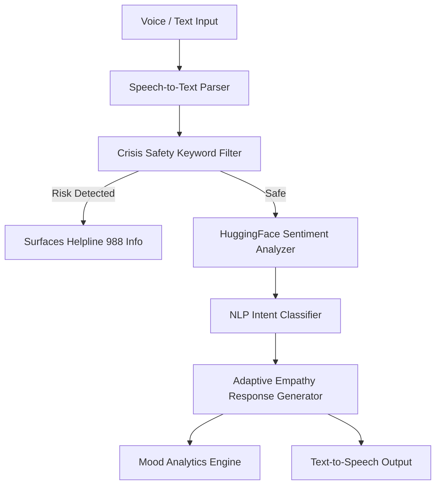

# 🧠 AuraMind — Voice-Enabled Conversational AI for Mental Health Support

> **Developer Notes**: Built to explore adaptive tone synthesis, real-time emotion classification, and safety crisis protocols in conversational agents.

---

## 📌 Architecture & Design

AuraMind is an empathetic voice-enabled AI companion. It tracks session emotional valence, adapts empathy levels dynamically, and surfaces crisis safety helplines whenever risk keywords are detected.

## 🛡️ Safety & Ethical Guidelines
This project is an academic AI research prototype designed for conversational support. It includes hardcoded crisis safety filters and emergency helpline notifications.
